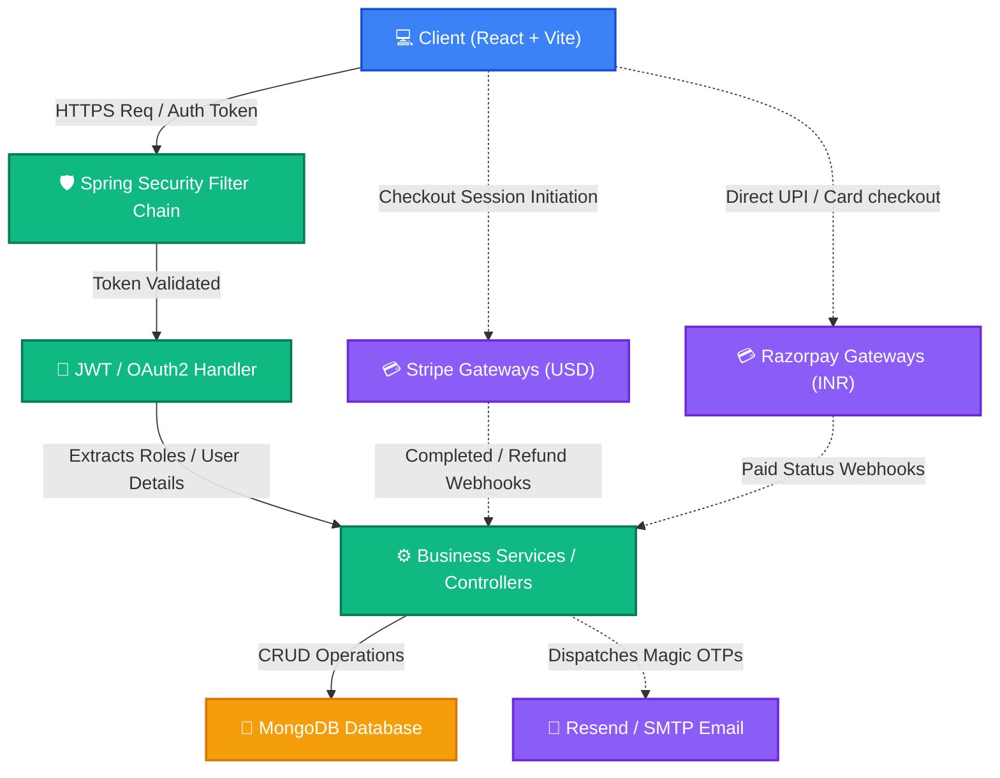

# 📦 OrderStream — Advanced Full-Stack Order Management System

OrderStream is a premium, state-of-the-art enterprise-grade Order Management System (OMS) designed to deliver real-time control, advanced security, and seamless payment processing. Architected with a resilient **Spring Boot 3** backend and a lightning-fast **React (Vite)** frontend, it integrates multiple payment methods, secure OAuth2 and magic link logins, and instant email services with MongoDB persistence.

---

## 🚀 Key Features

*   **🛡️ Multi-Role Security & RBAC**: Advanced Role-Based Access Control enforcing granular endpoint authorization across **Admin**, **Manager**, and **Customer** roles.
*   **🔑 Multi-Channel Authentication**:
    *   Secure **JWT-based session authentication** (stored via HttpOnly headers/secure client side storage).
    *   ⚡ **Passwordless Login** (Magic Link) via specialized secure tokens.
    *   📧 **OTP Email Verification** for extra safety upon registration.
    *   🌍 **Social Logins** (Google OAuth2 and GitHub OAuth2) with seamless automatic user registration.
*   **💳 Dual Payment Gateways**:
    *   **Stripe** integration supporting international multi-currency checkouts (USD).
    *   **Razorpay** integration designed specifically for Indian transaction systems (INR).
    *   🛡️ Secure payment verification utilizing automated backend webhook event handshakes.
*   **📊 Dynamic Business Analytics**: Real-time sales telemetry, active customer trackers, dynamic order volume timelines, and high-converting product dashboards.
*   **📂 Comprehensive Document Management**: Full CRUD capabilities for Products, Orders, Customers, Profile Settings, and Billing Subscription Plans.
*   **🍂 Robust MongoDB Backend**: Scalable document-based database configuration supporting localized deployments or high-availability cloud configurations (MongoDB Atlas).

---

## 🛠️ Technology Stack

| Component | Technology | Description |
| :--- | :--- | :--- |
| **Frontend** | React 18, Vite, Tailwind CSS, Lucide Icons, Axios | Ultra-fast client, clean layout, responsive grids, sleek visuals. |
| **Backend** | Spring Boot 3, Spring Security, Spring Data MongoDB | High-performance, robust, secure REST APIs. |
| **Database** | MongoDB | Highly flexible document storage for dynamic order JSON metadata. |
| **Payments** | Stripe SDK, Razorpay SDK | Double-shielded financial checkout pipelines. |
| **Mailing** | Resend API, Gmail SMTP | Instant OTP and magic link dispatchers. |
| **Auth** | OAuth2, Spring Security Core (JWT) | Google Cloud Console, GitHub Developer integrations. |

---

## 📐 System Architecture Diagram

This diagram displays the full-scale request authorization, authentication, payment checkout, and data-flow routing inside **OrderStream**:



---

## 🛠️ Step-by-Step Installation Guide

### 📋 Prerequisites

Ensure you have the following installed on your developer machine:
*   **Java 17 or higher**
*   **Node.js 18 or higher**
*   **MongoDB Community Edition** (local instance or cloud cluster connection string)
*   **Git**

---

### 📥 Local Initialization

#### 1. Setup the Root System
Clone your workspace and navigate to the project directory:
```bash
cd order-management-system
```

#### 2. Configure Environment Variables
Copy the `.env.example` configurations to local `.env` variables:

*   **For Backend Setup**:
    ```bash
    cp backend/.env.example backend/.env
    ```
    Open `backend/.env` and supply the following variables:
    ```env
    # Database
    SPRING_DATA_MONGODB_URI=mongodb://localhost:27017/order_management

    # JWT Authentication Key (Minimum 32 characters)
    JWT_SECRET=your-secure-random-jwt-secret-at-least-32-chars
    JWT_EXPIRATION=86400000

    # Resend API Key (Email Service)
    RESEND_API_KEY=re_your_api_key_here

    # Google Client Credentials
    GOOGLE_CLIENT_ID=your-google-client-id.apps.googleusercontent.com
    GOOGLE_CLIENT_SECRET=GOCSPX-your-google-secret

    # GitHub Client Credentials
    GITHUB_CLIENT_ID=your-github-client-id
    GITHUB_CLIENT_SECRET=your-github-secret

    # Stripe Test Credentials
    STRIPE_PUBLISHABLE_KEY=pk_test_your_stripe_publishable_key
    STRIPE_SECRET_KEY=sk_test_your_stripe_secret_key
    STRIPE_WEBHOOK_SECRET=whsec_your_stripe_webhook_secret

    # Razorpay Test Credentials
    RAZORPAY_KEY_ID=rzp_test_your_razorpay_key_id
    RAZORPAY_KEY_SECRET=your_razorpay_key_secret
    RAZORPAY_WEBHOOK_SECRET=your_razorpay_webhook_secret

    # Server Core Configurations
    APP_FRONTEND_URL=http://localhost:5173
    APP_MAGIC_LINK_SECRET=your-unique-magic-link-token-generation-key
    ```

*   **For Frontend Setup**:
    ```bash
    cp frontend/.env.example frontend/.env
    ```
    Verify that `frontend/.env` points to the correct backend endpoint:
    ```env
    VITE_API_URL=http://localhost:8080/api
    ```

---

### 🚀 Running the Services

#### 1. Start MongoDB (If running locally)
```bash
mongod
```

#### 2. Run the Spring Boot Backend
Open a separate terminal window and run:
```bash
cd backend
mvn clean spring-boot:run
```

#### 3. Run the React Frontend
Open another terminal window, install dependency nodes, and start the development server:
```bash
cd frontend
npm install
npm run dev
```

Your web application will now be running at **`http://localhost:5173`**!

---

## 🔒 Authentication Flows Detailed

*   **Registration OTP Flow**: On the sign-up page, a new customer submits details. An email is dispatched with a unique **6-digit validation OTP**. Submitting the correct OTP activates the database user.
*   **Passwordless Magic Links**: Simply enter your registered email. The backend creates a cryptographic link valid for single-use within 15 minutes, allowing rapid secure sign-ins.
*   **Third-Party OAuth2**: Authenticating through Google or GitHub returns a validated code to our Spring Security callback backend (`/login/oauth2/code/*`). The backend establishes a database profile, issues an optimized JWT, and routes the authenticated client to the landing dashboard.

---

## 💳 Payment Gateway Credentials

### 💳 Stripe Sandbox Checks

*   **Mode**: Sandbox / Test Mode
*   **Test Cards**:
    *   Visa: `4242 4242 4242 4242`
    *   Mastercard: `5555 5555 5555 4444`
*   **Expiry / CVC**: Use any future expiry date and any 3-digit CVV number.

### 💳 Razorpay Sandbox Checks

*   **Mode**: Test Mode
*   **Test UPI**: `success@razorpay`
*   **Test Cards**: `4111 1111 1111 1111`
*   **Netbanking Verification**: Pick any banking partner, and authorize using the test OTP: `1234`.

---

## 👥 Role & Authorization Matrix

| Access Permissions | Customer (`ROLE_CUSTOMER`) | Manager (`ROLE_MANAGER`) | Admin (`ROLE_ADMIN`) |
| :--- | :---: | :---: | :---: |
| View Personal Orders | ✅ | ✅ | ✅ |
| Create New Orders | ✅ | ✅ | ✅ |
| Update Personal Profile | ✅ | ✅ | ✅ |
| View Sales Analytics Dashboards | ❌ | ✅ | ✅ |
| Manage Products & Inventories | ❌ | ✅ | ✅ |
| Edit Customers & Assign Roles | ❌ | ❌ | ✅ |
| Delete Orders & Invoices | ❌ | ❌ | ✅ |
| Adjust System Billing Configuration | ❌ | ❌ | ✅ |

---

## 🛡️ Default Seeding System Accounts

Upon first launch, the system automatically checks and populates the MongoDB collections with three pre-seeded access credentials:

| Username | Password | Assigned Security Role |
| :--- | :--- | :--- |
| **admin** | `admin123` | `ROLE_ADMIN` |
| **manager** | `manager123` | `ROLE_MANAGER` |
| **demo** | `demo123` | `ROLE_CUSTOMER` |

---

## 🛠️ Troubleshooting Guide

| Primary Symptom | Root Cause | Working Resolution |
| :--- | :--- | :--- |
| **OTP Failure / Non-delivery** | Invalid or missing `RESEND_API_KEY` | Ensure api-keys are copied correctly from `resend.com/api-keys`. |
| **CORS Access Blocked** | Dynamic Port mismatch | Verify frontend runs on `5173` and backend services run on `8080`. |
| **401/Unauthorized Page** | Outdated or mismatched OAuth redirect parameters | Double check console redirect URI: `http://localhost:8080/login/oauth2/code/google` (or `github`). |
| **JWT Errors / Session Timeout** | Cryptographic key too weak | Make sure `JWT_SECRET` is at least 32 characters in length. |
| **MongoDB Refused Connection** | Database daemon stopped | Start MongoDB locally (`mongod`) or configure proper Atlas Atlas connection parameters in `.env`. |

---

## 📄 License
This project is licensed under the MIT License - see the LICENSE file for details.
